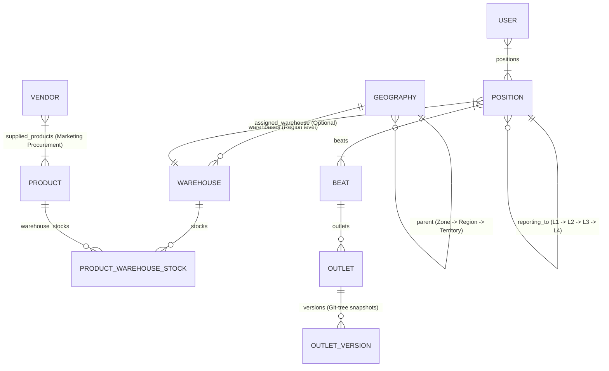

# Sastrybalm ERP — Sales & Distribution System Guide

## Overview
Sastrybalm ERP is a comprehensive FMCG Sales & Distribution Management System built with **FastAPI**, **SQLAlchemy**, **Jinja2 Templates**, and **MySQL (MAMP)**.

The system orchestrates:
- **Admin Onboarding & Dual-Bucket S3 Storage**: Onboarding handles Administrator account password setup and optional database backup restoration. S3 Object Storage is configured in **Admin Dashboard → System Settings → S3 Storage**, supporting two separate buckets: **Permanent Files - Bucket** (`s3_bucket_name`) for outlet photos, material requests, QC pictures, avatars, and **Parquet Daily Rolling Backups**, and **Temporary Files - Bucket** (`s3_files_bucket_name`) for database backups, PDF exports, & temporary reports.
- **Parquet Daily Rolling Backup Architecture**: Automated daily background job in `app/scheduler.py` (`01:00 AM IST`) and manual trigger in `/settings/backup`. Exports 12 operational/transactional tables (`orders`, `order_items`, `payments`, `payment_submissions`, `attendance`, `timesheets`, `expenses`, `material_requests`, `material_request_history_logs`, `vendor_quotations`, `work_orders`, `stock_movements`) up to the previous day into Snappy-compressed Apache Parquet format. Organizes objects in **Permanent Files - Bucket** under daily directory structure: `rolling_backups/parquet/YYYY-MM-DD/<table_name>.parquet`.
- **Server Startup & Entrypoint Migration Architecture**: Database migrations (`db_migrate.py`) run once in `entrypoint.sh` (PID 1) before Gunicorn forks workers — preventing multi-worker `ALTER TABLE` deadlocks. FastAPI `lifespan` only runs startup validation and scheduler init. Safe exception handling in `is_system_onboarded()` and `validate_s3_configuration()` for uninitialized databases.
- **Geography & Regional Warehouse Architecture**: Multi-tier hierarchy (`Zone` → `Region` → `Territory`) with region-level warehouse mapping and unified scoping (`get_user_allowed_geography_ids` & `get_user_allowed_warehouse_ids`).
- **Position Hierarchy**: 4-level organizational hierarchy (`L1` to `L4`) with automatic reporting parent warehouse inheritance resolution.
- **Beat & Outlet Management**: Beat territory selection scoped to L1 child territories under position/region hierarchy. Outlet scoping, non-admin approval workflows (`outlet_edit_approval`), Admin direct edit `OutletVersion` snapshots, version history, and Git-tree style version reverts.
- **Product & Inventory System**: PTR (Price to Retailer) pricing, multi-warehouse stock allocation scoped to user warehouses, zero-stock deactivation guardrails, and Stock Audit Log filter bar.
- **Vendor Operations**: Vendor supply management strictly scoped to assigned Region and child Territories.
- **Channel Partners**: Multi-channel distribution without CSV export clutter.
- **Action Center**: Centralized **Action Center** section housing **Approval Hub** (restricted to Position level > L2 & Geography scope >= Region or Admin with scoped pending counts), **Alerts & Notifications**, and **Auto-Flags** risk detection.
- **Analytics (Realtime & Scheduled)**: OOTB preset-filtered Realtime Analytics and Scheduled Analytics CSV report generator uploaded to S3/MinIO with expiring pre-signed URLs.
- **Sidebar Navigation Section Hierarchy**: Master Data menu scoping (hiding `Users & Reps` and `Positions` for Territory Managers) and Action Center section integration.

---

## 🏛️ System Architecture & Data Models

### Database Connection & Lifespan Validation
- **DB Engine**: MySQL (MAMP default on `127.0.0.1:8889`, database `sastrybalm_db`, user `root`, password `root`).
- **ORM Base**: SQLAlchemy 2.0.
- **Lifespan Startup Health Check**: `app/services/startup_validation.py` executes `validate_admin_and_s3_config()` inside FastAPI lifespan (`app/main.py`) on every server restart to verify an active Admin user exists and ping S3/MinIO storage.
- **S3 / MinIO Storage Adapter**: `app/adapters/s3_storage.py` manages image uploads (Outlets, Assets, Material Requests, Work Orders, Maintenance Logs), daily database backups, and pre-signed CSV report downloads.
- **Migration Script**: `PYTHONPATH=. ./venv/bin/python db_migrate.py`

### Key Models & Relationships



---

## 📍 1. Geography & Regional Warehouse Architecture

### Hierarchy Rules
1. **Zone**: Top-level geography node (`parent_id = None`).
2. **Region**: Mid-level node; **MUST** report to a `Zone`.
3. **Territory**: Field-level node; **MUST** report to a `Region`.

### Regional Warehouses & Unified Scoping Resolution
- Warehouses are assigned directly at the **Region** level (`Geography.level == GeoLevel.region`).
- **Bidirectional Model Relationship**: `Geography.warehouses` and `Warehouse.geography` maintain explicit bidirectional SQLAlchemy relationship `back_populates="geography"`, ensuring checkboxes in `/geography/{id}/edit` render DB selections accurately.
- **Unified Geography & Warehouse Scoping (`app/utils/geography_scope.py`)**:
  - `get_user_allowed_geography_ids(user, db)`: Resolves assigned Region + child Territories for Territory Managers based on `user.geography_id` or active `UserPosition` -> `Position.geography_id`. Admin receives `None` (unlimited scope).
  - `get_user_allowed_warehouse_ids(user, db)`: Resolves all warehouses attached to the user's allowed region geography IDs.

---

## 👔 2. Position Hierarchy & Warehouse Resolution

### Position Levels
- **L4**: Top-level executive management (`reporting_to_id = None`).
- **L3**: Regional management (reports to `L4`).
- **L2**: Area/Territory management (reports to `L3`).
- **L1**: Field sales representative / Beat execution level (reports to `L2`).

### Warehouse Resolution Algorithm (`resolve_warehouse`)
When an **Outlet** places an Order, Asset Request, or Material Request:
1. Identify the **L1 Position** linked to the Outlet's **Beat Route**.
2. Execute `position.resolve_warehouse()`:
   - Check if the **L1 Position** has a directly assigned active `warehouse_id`.
   - If not, traverse up the `reporting_to` hierarchy: **L2** → **L3** → **L4**.
   - Return the first active `Warehouse` found along the parent reporting chain.

---

## 📦 3. Product Catalog, Inventory Scoping & Audit Log Filters

### Category Scopes (`ProductCategory`)
- **Sales**: Core commercial FMCG products sold to retailers/outlets via Beats.
- **Marketing - Procurement**: Specialized promotional items supplied by external Vendors.
- **Marketing - Stock**: Promotional marketing items stored in warehouses.

### Inventory Scoping & Unmapped Warehouse Exclusion
- **Product List Scoping (`app/routers/inventory.py`)**: Products shown in the Stock Inventory page are strictly filtered to products that are attached to at least one active warehouse in the user's allowed warehouse scope (`get_user_allowed_warehouse_ids`). Products with no attached warehouses in the user's scope (e.g. `FRONTLIT-BOARD`) are completely excluded from view.
- **Attached Warehouse Badge Scoping (`app/templates/inventory/list.html`)**: Warehouse badges rendered under "Attached Warehouses" and stock totals are strictly filtered so that unauthorized warehouses (e.g. `TN COIMBATORE` for `kkalpanamuthu`) are hidden, and total units display only the stock balance within authorized warehouses.
- Product inventory breakdown modals (`/product/{id}/warehouse-details`), stock inwarding, and stock adjustments are strictly scoped to allowed user warehouses.

### Stock Audit Log Filters (`app/templates/inventory/movements.html`)
- Provides filter bar for searching stock movements by:
  - **Warehouse**
  - **Product**
  - **Movement Type** (`INWARD`, `OUTWARD`, `ADJUSTMENT`)
  - **Date From** & **Date To**

---

## 🏬 4. Vendors & Scope Control

- **Region Scope Field Refactoring**: Vendor list, creation, and edit routes (`app/routers/vendors.py`) enforce `Vendor.geography_id.in_(allowed_geo_ids)`.
- **Territory Manager Scope**: Territory Managers (e.g. `kkalpanamuthu10@gmail.com` with `North TN` scope) only see and manage vendors within their assigned Region and child Territories. Unauthorized regions (e.g. `Odisha`) are excluded.
- **Vendor Product Scope**: Restricted strictly to products with `category_type == ProductCategory.marketing_procurement`.

---

## 🏪 5. Outlets Scoping, Approval Mechanism & Git-Tree Version Reverts

- **Geography Scoping**: `app/routers/outlets.py` filters `Outlet.territory_id.in_(allowed_geo_ids)`.
- **Non-Admin Edit Approval Workflow**: When a Territory Manager or Field Rep submits an outlet edit, the outlet is NOT modified directly. An `AutoFlag` approval request (`entity_type="outlet_edit_approval"`) is created for Admin review.
- **Direct Admin Edit & Snapshotting**: Direct edits by Admin update the outlet after recording a pre-edit snapshot in `OutletVersion` (`app/models/outlet_version.py`).
- **Version History & Git-Tree Reverts**:
  - `/outlets/{id}/history` displays the version timeline (`app/templates/outlets/history.html`).
  - `/outlets/{id}/revert/{version_id}` allows Admins to revert the outlet to any prior state snapshot.

---

## 🛣️ 6. Beats & Routes Scoping

- **Territory Scoping**: Territory select control in Beat create/edit forms (`app/routers/beats.py`) only lists L1 child territories under the user's assigned position/region hierarchy (e.g. `Chennai TN` for `TN CHENNAI RSM`, hiding `Bhubaneswar Odisha`).
- **Channel Partner Scoping**: Channel Partners select list inside Beat forms is scoped to `get_user_allowed_geography_ids`.

---

## 🔔 7. Action Center (Approval Hub, Alerts, Auto-Flags)

The **Action Center** section in sidebar navigation (`app/templates/shared/sidebar.html`) aggregates operational workflows:

### A. Approval Hub (`/approvals`)
- **Access Rule**: Restricted to Admin and users with Position level > L2 (L3, L4, L5) and Geography scope >= Region (Region, Zone).
- **Geography-Scoped Pending Counts**: Calculates pending counts across Attendance, Timesheets, Payment Submissions, Expenses, Material Requests, and Outlet Edits filtered by user allowed geography IDs.

### B. Alerts & Notifications (`/analytics/alerts`)
- Operational alerts for unread counts, low stock warnings, and alert dismiss actions.

### C. Auto-Flags (`/flags`)
- Automated risk & anomaly detection flags:
  - `gps_out_of_range`: Location > 100m from outlet coordinates.
  - `short_visit`: Store visit < 2 minutes.
  - `gps_spoofing`: Mock location detection.
  - `payment_mismatch`: Denomination total mismatch against payment amount.
  - `outlet_edit_approval`: Master data outlet modification requests.

---

## 📊 8. Realtime & Scheduled Analytics

- **Realtime Analytics**: Preset chart-centric views for Sales Analytics (`/analytics/sales`), Rep Performance (`/analytics/reps`), and Marketing (`/analytics/marketing`).
- **Scheduled Analytics (`/analytics/scheduled`)**: Asynchronous CSV report generator (Sales Summary, Rep Performance, Inventory Audit, Master Outlets Register) uploaded to S3/MinIO with time-bound expiring download links.

---

## 👥 9. User Roles, Scope Matrix & Menu Restrictions

### Permissions & Menu Visibility
| Role (`UserRole`) | Scope & Navigation Visibility |
| :--- | :--- |
| **`admin`** | **Full Access**: All sections, Master Data (`Users & Reps`, `Positions`, `Geography`, `Beats`, `Outlets`, `Channel Partners`, `Vendors`), Configuration, Action Center. |
| **`territory_manager`** | **Regional Management Scope**: Assigned to Region (`Geography`). <br>• **Products Catalogue Restricted**: `/products` page, creation, and edits are strictly restricted to Admins. Hidden under Catalogue in sidebar navigation and inventory header. <br>• **Master Data Menu Scoping**: `Users & Reps` and `Positions` are hidden under Master Data in sidebar. Retains `Geography`, `Beats & Routes`, `Outlets` (approval-based edit), `Channel Partners` (CSV button removed), and `Vendors`. <br>• **Action Center Scope**: Access to Approval Hub (if Position > L2 & Geo >= Region), Alerts, Auto-Flags. |
| **`field_rep`** | **Field Mobile Execution**: Route visits, order taking, outlet edits (creates approval request), attendance, expenses. |

---

## 🧭 10. Sidebar Navigation Section Hierarchy

Standardized sidebar layout (`app/templates/shared/sidebar.html`):
1. **Dashboard**
2. **Field Tracking** *(Attendance, Visit Records, GPS Map View)*
3. **Operations** *(Orders, Expenses, Timesheets, Material Requests, Marketing Assets)*
4. **Action Center** *(Approval Hub, Alerts & Notifications, Auto-Flags)*
5. **Analytics** *(Sales Analytics, Rep Performance, Marketing, Scheduled Reports S3)*
6. **Catalogue** *(Products, Inventory, Warehouses)*
7. **Master Data** *(Geography, Users & Reps [Admin Only], Positions [Admin Only], Beats & Routes, Outlets, Channel Partners, Vendors)*
8. **Configuration** *(Sales Channels, SMTP Settings, Webhooks, WhatsApp API, Data Backup)*
9. **Developer** *(Mobile API Docs)*

---

## 🛠️ Common Operations & Developer Commands

### Run Development Server
```bash
PYTHONPATH=. ./venv/bin/python run.py
```

### Apply Database Migrations
```bash
PYTHONPATH=. ./venv/bin/python db_migrate.py
```

### Verify Python Syntax
```bash
python3 -m py_compile app/main.py app/services/startup_validation.py app/adapters/s3_storage.py app/utils/geography_scope.py app/routers/vendors.py app/routers/outlets.py app/routers/inventory.py app/routers/warehouses.py app/routers/beats.py app/routers/approvals.py app/routers/analytics.py
```

---

## 🐳 11. Docker Containerization, Immutable Image Packaging & Deployment

### Image Architecture & Dependency Encapsulation
- **Multi-Stage Dockerfile (`Dockerfile`)**: Pre-compiles and installs all mandatory dependencies from `requirements.txt` (`boto3`, `botocore`, `gunicorn`, `cryptography`, `fastapi`, `pymysql`, `sqlalchemy`) into `/usr/local`.
- **Zero-Installation Target Deployment**: When built locally or via CI/CD, the Docker image encapsulates all Python packages into an immutable container artifact. Target servers loading the container image via Docker Hub/Registry or `docker load < sastrybalm-app.tar.gz` run instantly without downloading or installing any dependencies from scratch.
- **Docker Entrypoint Migration Architecture (`entrypoint.sh`)**: Database migrations (`python db_migrate.py`) run **once in PID 1** before Gunicorn forks workers. This prevents multi-worker `ALTER TABLE` deadlocks (MySQL 1213) and ensures all tables exist before any worker serves requests. The FastAPI `lifespan` handler does NOT run migrations — only startup validation and scheduler init.
- **Gunicorn `--timeout 120`**: Workers get 120 seconds (up from default 30) to complete startup, preventing premature SIGABRT on slow MySQL connections.
- **Docker Compose Architecture (`docker-compose.yml`)**:
  - `db`: MySQL 8.0 instance on port 3308 (internal 3306).
  - `app`: FastAPI web application running Gunicorn with 4 Uvicorn workers on port 8090, using `entrypoint.sh`.
  - `nginx`: Reverse proxy on port 8080.
  - `adminer`: Web-based database management GUI on port 8081.

### Production Docker Commands
```bash
# Build immutable production container image
docker compose build

# Export image package for offline target server deployment
docker save sastrybalm-app:latest | gzip > sastrybalm-app.tar.gz

# Load and launch on target environment
docker load < sastrybalm-app.tar.gz
docker compose up -d
```

---

## 📦 12. Parquet Daily Rolling Backup Architecture

### Data Scope & Export Mechanism
- **Operational & Transactional Data**: Automatically queries 12 core operational models up to yesterday (`cutoff_date = datetime.utcnow().date() - timedelta(days=1)`):
  - `Order` (`orders`) & `OrderItem` (`order_items`)
  - `Payment` (`payments`) & `PaymentSubmission` (`payment_submissions`)
  - `Attendance` (`attendance`) & `Timesheet` (`timesheets`)
  - `Expense` (`expenses`)
  - `MaterialRequest` (`material_requests`) & `MaterialRequestHistoryLog` (`material_request_history_logs`)
  - `VendorQuotation` (`vendor_quotations`) & `WorkOrder` (`work_orders`)
  - `StockMovement` (`stock_movements`)
- **Parquet Format**: Converts rows into Apache Parquet format using `pyarrow` and `pandas` with Snappy compression for optimal data warehousing and analytical query performance.
- **S3 Bucket Target**: Uploads directly to **Permanent Files - Bucket** (`s3_bucket_name`).
- **Daily Directory Structure**:
  ```text
  rolling_backups/parquet/YYYY-MM-DD/orders.parquet
  rolling_backups/parquet/YYYY-MM-DD/order_items.parquet
  rolling_backups/parquet/YYYY-MM-DD/payments.parquet
  rolling_backups/parquet/YYYY-MM-DD/payment_submissions.parquet
  rolling_backups/parquet/YYYY-MM-DD/attendance.parquet
  rolling_backups/parquet/YYYY-MM-DD/timesheets.parquet
  rolling_backups/parquet/YYYY-MM-DD/expenses.parquet
  rolling_backups/parquet/YYYY-MM-DD/material_requests.parquet
  rolling_backups/parquet/YYYY-MM-DD/material_request_history_logs.parquet
  rolling_backups/parquet/YYYY-MM-DD/vendor_quotations.parquet
  rolling_backups/parquet/YYYY-MM-DD/work_orders.parquet
  rolling_backups/parquet/YYYY-MM-DD/stock_movements.parquet
  ```
- **Automated Scheduler**: Triggered every night at **01:00 AM IST** via `job_daily_parquet_backup` in `app/scheduler.py`.
- **Manual Trigger Route**: Admin button **"⚡ Run Parquet Rolling Backup Now"** on [/settings/backup](http://localhost:8090/settings/backup) (`POST /settings/backup/parquet-rolling-backup`).

### Two-Stage Hybrid Data Lifecycle & Archival Strategy
1. **Stage 1 (Soft Archival - Post-Parquet Upload)**:
   - When daily Parquet rolling backup completes and uploads to **Permanent S3 Bucket**, all exported records up to yesterday are soft-archived (`is_archived = True`, `archived_at = timestamp`).
   - Active SQL queries run fast on `is_archived = False`, while reporting screens maintain operational context without breaking.
2. **Stage 2 (Hard Retention Purge - Configurable Retention Window)**:
   - Records older than the configured retention window (**default: 90 days**, configurable in `SystemConfiguration.archival_retention_days`) that are soft-archived (`is_archived = True`) are permanently deleted from the SQL database.
   - Foreign-key child records (`order_items`, `payment_submissions`, `vendor_quotations`, `material_request_history_logs`) are deleted first to preserve referential integrity.
3. **Safety Guards**:
   - Parquet backups, soft-archival, and hard retention purges execute **ONLY** if Permanent S3 Bucket is enabled (`s3_is_enabled == True`) and connection test passes.

---

## 🖼️ 13. Dual Bucket Directory Scoping & UI Image Viewer Architecture

### Bucket Classification & Directory Rules
1. **Permanent Files - Bucket (`s3_bucket_name`)**: Stores all long-term operational images, documents, and transactional Parquet backups under dedicated directory keys:
   - Outlets Signboard Photos: `outlets/`
   - Marketing Assets & Proof of Deployment: `assets/`
   - Material Request Attachments: `material_requests/`
   - Work Orders QC Verification Photos: `work_orders/qc/`
   - Vendor Invoices & Proformas: `vendor_invoices/`
   - User Profile Avatars: `avatars/`
   - Parquet Daily Rolling Backups: `rolling_backups/parquet/YYYY-MM-DD/`

2. **Temporary Files - Bucket (`s3_files_bucket_name`)**: Stores ephemeral artifacts:
   - Scheduled Analytics CSV Exports: `analytics/scheduled/`
   - Full Database Backups (`.sql`): `backups/`

### UI Image Viewing & Lightbox Modal
- **Global Lightbox Modal (`app/templates/base.html`)**: Includes `global-image-viewer-modal` rendered with glassmorphism backdrop blur and full-screen image display.
- **JavaScript Helper**: `openImageViewer(url, title)` opens the full-size image instantly when clicked.
- **Interactive Thumbnails**: Rendered across Outlets list (`outlets/list.html`), Assets list (`asset_capitalizations/list.html`), Material Requests list (`material_requests/list.html`), and Material Request Detail & QC inspection records (`material_requests/detail.html`).

---

## 👥 14. User Onboarding, Geography Allotment & Position Hierarchy Scope Rules

### A. Geography Allotment & Single-Manager Rule
- **Single Territory Manager Rule**: A Region/Geography (`Geography`) can only be assigned to **ONE** active Territory Manager (`UserRole.territory_manager`).
- **Form Context Dropdown Filtering (`app/routers/users.py`)**: `_form_context` queries all geographies currently assigned to active Territory Managers and excludes them from the `Managing Region / Zone (Geography Scope)` dropdown when creating a new user (`/users/new`). When editing an existing user (`/users/{id}/edit`), the user's current geography is retained in their edit options.
- **Backend Validation**: `user_create` and `user_update` reject forms submitting an already-allotted geography with error `"Geography is already assigned to active Territory Manager '<Name>'."`

### B. Managing Geography Level to Position Hierarchy Mapping
- **Level Scope Mapping**: Position availability dynamically filters based on the level (`level_code`) of the selected Managing Geography:
  - **Territory** scope $\rightarrow$ **L1** & **L2** positions.
  - **Region** scope $\rightarrow$ **L3** positions.
  - **Zone** scope $\rightarrow$ **L4** positions.
- **Dynamic Frontend Filtering (`app/templates/users/form.html`)**: Options render `data-level="{{ g.level_code }}"` and position items render `data-level="{{ p.level_code }}"`. When a geography is selected or changed, `filterPositions()` instantly shows matching position levels and hides out-of-scope positions.
- **Server-Side Validation**: `user_create` and `user_update` in `app/routers/users.py` validate position level against managing geography level prior to DB insertion/update.

### D. Permission Matrix Access Restriction & Default Module Scope
- **Restricted Roles**: Users created or edited with roles `field_rep`, `vendor_admin`, `vendor_technician`, or `qc_manager` **cannot** access or view the Dashboard & Feature Access Permission Matrix in New/Edit forms.
- **Frontend UI Visibility**: `updateRoleScopedFields()` in `app/templates/users/form.html` automatically hides `#permission-matrix-container` (`classList.add('hidden')`) for these restricted roles. The matrix is only accessible when assigning `admin` or `territory_manager` system roles.
- **Automated Default Module Provisioning**: `_resolve_user_modules(role, submitted_modules)` in `app/routers/users.py` automatically provisions standard role modules on form submit:
  - **`field_rep`**: `["orders", "inventory", "expenses", "timesheets", "attendance", "visits", "gps_map"]`
  - **`vendor_admin` / `vendor_technician`**: `["orders", "inventory", "expenses"]`
  - **`qc_manager`**: `["orders", "inventory", "material_requests", "approvals"]`

### F. Permission Matrix to Sidebar Navigation Enforcement
- **Dynamic Navigation Scoping (`app/templates/shared/sidebar.html`)**: The sidebar template extracts the user's enabled modules via `mods = current_user.active_modules()`.
- **Module to Menu Item Mapping**:
  - `attendance` $\rightarrow$ Attendance
  - `visits` $\rightarrow$ Visit Records (with role check)
  - `gps_map` $\rightarrow$ GPS Map View (with role check)
  - `orders` $\rightarrow$ Orders
  - `expenses` $\rightarrow$ Expenses
  - `timesheets` $\rightarrow$ Timesheets
  - `inventory` $\rightarrow$ Material Requests & Marketing Assets (for non-admin users) / Inventory (Catalogue)
  - `approvals` $\rightarrow$ Approval Hub, Alerts & Notifications, Auto-Flags
  - `analytics` $\rightarrow$ Sales Analytics, Rep Performance, Marketing, Scheduled Reports
- **Admin Bypass**: `system_role == admin` bypasses individual module toggles to preserve complete system configuration & management oversight.
- **Eager Loading (`app/dependencies.py`)**: `get_current_web_user` uses `options(joinedload(User.module_access))` to ensure clean template rendering without lazy loading overhead.

### G. Structured Section URL Slugs Architecture
All Web UI routes are structured with section prefixes corresponding to their sidebar tab hierarchy:
- **Field Tracking (`/tracking/...`)**: `/tracking/attendance`, `/tracking/visits`, `/tracking/map`
- **Operations (`/operations/...`)**: `/operations/orders`, `/operations/expenses`, `/operations/timesheets`, `/operations/material-requests`, `/operations/marketing-assets`
- **Action Center (`/action-center/...`)**: `/action-center/approvals`, `/action-center/alerts`, `/action-center/flags`
- **Analytics (`/analytics/...`)**: `/analytics/sales`, `/analytics/reps`, `/analytics/marketing`, `/analytics/scheduled`
- **Catalogue (`/catalogue/...`)**: `/catalogue/products`, `/catalogue/inventory`, `/catalogue/warehouses`
- **Master Data (`/master-data/...`)**: `/master-data/geography`, `/master-data/users`, `/master-data/positions`, `/master-data/beats`, `/master-data/outlets`, `/master-data/channel-partners`, `/master-data/vendors`
- **Configuration (`/settings/...`)**: `/settings/...`
- **Legacy Path Redirects**: Backward-compatibility 307 redirects are mounted in `app/main.py` for legacy top-level routes (e.g. `/orders` $\rightarrow$ `/operations/orders`).

---

## 📱 15. Mobile SFA API & Executive Architecture

### A. Mobile Authentication & OTP Verification
- **Authentication Routes (`app/routers/api/auth.py`)**:
  - `POST /api/v1/auth/token`: Admin password login returning Bearer JWT token.
  - `POST /api/v1/auth/request-otp`: Field Rep OTP request dispatched via Email/Alerts.
  - `POST /api/v1/auth/verify-otp`: OTP verification & JWT issuance for Field Reps. Enforces active checkout session lock.
  - `GET /api/v1/auth/me`: Authenticated user profile lookup (`UserResponse` with `can_access_restricted_modules` flag).

### B. Mobile Master Data & Operations API Endpoints
- **Master Data (`app/routers/api/master.py`)**:
  - `GET /api/v1/config`: Mobile sync configuration (`payment_mode`, `denomination_mandatory`, `gps_threshold_metres`, `sync_interval_seconds`).
  - `GET /api/v1/geography/tree`: Full geography tree for offline mobile caching.
  - `GET /api/v1/beats`: Active beats list & `GET /api/v1/beats/my` (assigned beats).
  - `GET /api/v1/outlets`: Paginated outlet list, `GET /api/v1/outlets/{id}`, & `PATCH /api/v1/outlets/{id}/location` (mobile GPS update).
  - `GET /api/v1/products`: Product catalog for offline caching (with MRP & GST rate).
- **Operations (`app/routers/api/operations.py`)**:
  - `POST /api/v1/attendance/checkin` & `/checkout`: Geofenced shift attendance & timesheet tracking.
  - `GET /api/v1/attendance/history` & `GET /api/v1/visits/my`: History tracking logs.
  - `POST /api/v1/visits` & `/checkout`: Outlet visit logging with haversine distance verification.
  - `POST /api/v1/orders` & `/submit`: Create draft order & submit for ERP sync.
  - `POST /api/v1/payments`: Collect payment (Cash/UPI/Cheque/NEFT) with denomination breakdown.
  - `GET /api/v1/orders/my`, `GET /api/v1/payments/my`: Rep's history endpoints.
  - `GET /api/v1/work-orders/pending-qc` & `POST /api/v1/work-orders/{id}/qc-approve`: QC inspection approval with photo upload.

### C. Module Access Restriction Rules
- **Access Rule**: **Expenses**, **Timesheets**, and **Material Requests** are restricted ONLY to:
  1. `admin` users.
  2. `territory_manager` users whose assigned Geography level is `>= Region` (`Zone` or `Region`).
  3. All other roles (`field_rep`, `vendor_admin`, `vendor_technician`, `qc_manager`, or `territory_manager` assigned to `Territory` level below Region) are strictly blocked with `HTTP 403`.
- **Model Property (`User.can_access_restricted_modules`)**: Evaluates role and geography level depth safely, handling `DetachedInstanceError` when un-sessioned.
- **Dependency Guard (`app/dependencies.py`)**: `require_restricted_module_web_access` and `require_restricted_module_api_access` enforce permissions on web and API endpoints. Eager loading `joinedload(User.geography)` prevents lazy loading session detachments.
- **Mobile UI Dynamic Quick Actions**: `dashboard_tab.dart` dynamically switches Quick Action cards based on `user.canAccessRestrictedModules`.

### D. Complete Legacy Module Purge (`payment_submissions`)
- Fully purged legacy `payment_submissions` table, models (`payment_submission.py`), template directories (`app/templates/payment_submissions/`), router endpoints (`app/routers/payment_submissions.py`), and foreign key constraints (`payments.submission_id`).

### E. Executive Glassmorphic UI & Error Templates
- **Mobile Flutter UI**: Executive design system featuring multi-stop gradient workday card (`#3B82F6` → `#4F46E5` → `#7C3AED`), 3D ambient glow spheres, glassmorphic `WORKDAY ACTIVE` / `GpsStatusChip` pill badges, and floating bottom navigation bar (`#4F46E5` active tab highlight).
- **Web 403 & 404 Glassmorphic Error Pages (`app/templates/errors/403.html`)**: Centered glass card (`bg-slate-900/90 backdrop-blur-xl border border-slate-800 rounded-3xl`), glowing rose/indigo badge, dynamic exception detail message, and high-contrast text (`text-white` & `text-slate-300`).

### F. Alert & Notification Scoping Rules & Dual-Pane UI
- **Admin**: Sees **ALL** system alerts (`Alert` table).
- **Strict Login & OTP Alert Isolation**: Login alerts (titles matching `Login%`, `OTP%`, `%Login%`, or `%OTP%`) are strictly private. They are visible **ONLY to Admin and the specific user themselves** (`Alert.user_id == current_user.id`).
- **Territory Manager ($\ge$ Region)**: Sees own alerts + operational updates (Orders, Assets, Material Requests, Timesheets, Expenses, Vendor & Channel Partner updates) generated by subordinate L1 reps in their geography/position scope. Other users' private Login/OTP alerts are strictly excluded.
- **Dual-Pane Interface (`/action-center/alerts`)**: Admin and Territory Managers ($\ge$ Region) receive a 2-pane tabbed view:
  - **Pane 1 (`tab=personal`)**: *"My Personal Alerts"* addressing the current user directly.
  - **Pane 2 (`tab=operational`)**: *"Team & Operational Alerts"* displaying team/vendor updates across their allowed geography scope.
- **All Other Users (Field Reps, Vendor Admins, QC Managers, TMs < Region)**: See **ONLY** their own respective alerts in a single streamlined view (`Alert.user_id == current_user.id`).

### G. Operational Command Dashboard KPI Grid
- **Purged Non-Operational & Redundant KPIs**: Completely removed **SKUs/Products**, **Receivables**, and **System Health** cards from the main dashboard.
- **Clubbed Attendance & Workforce KPI**: Combined field workforce and daily attendance into a single high-impact card **`ATTENDANCE / WORKFORCE`** (`{{ checkins_today }} / {{ active_reps }}` e.g., `0/1` showing checked-in reps vs active reps under the user's geography scope).
- **Vendor & Asset Operational KPI Cards**: Introduced real-time vendor and asset operational metrics:
  1. `ATTENDANCE / WORKFORCE`: Shift checked-in reps / active field workforce under territory/region scope (`/tracking/attendance`).
  2. `OUTLETS SCOPE`: Total verified retail points in allowed geography scope (`/master-data/outlets?status=approved`).
  3. `ORDERS TODAY`: Active sales orders & ₹ volume generated today (`/operations/orders`).
  4. `MARKETING ASSETS`: Deployed marketing & signage assets (`/operations/marketing-assets`).
  5. `PENDING OUTLET APPROVALS`: Draft outlets awaiting manager approval (`/master-data/outlets?status=draft`).
  6. `WORK ORDERS`: Active vendor maintenance work orders (`WorkOrder` count).
  7. `VENDOR QUOTATIONS`: Pending quotes submitted by vendors awaiting review (`VendorQuotation` count).
- **Admin-Only Core Infrastructure Panel Scoping**:
  - Legacy offline sync items (`ZAP Sync`, `CMMS Sync`, `CONNECT Sync`) have been completely purged from the dashboard panel.
  - The **Core Infrastructure** panel (`API Core`, `Datastore`, `Job Scheduler`) is strictly scoped and visible **ONLY to System Administrators** (``). Hidden for Territory Managers and Field Reps.


