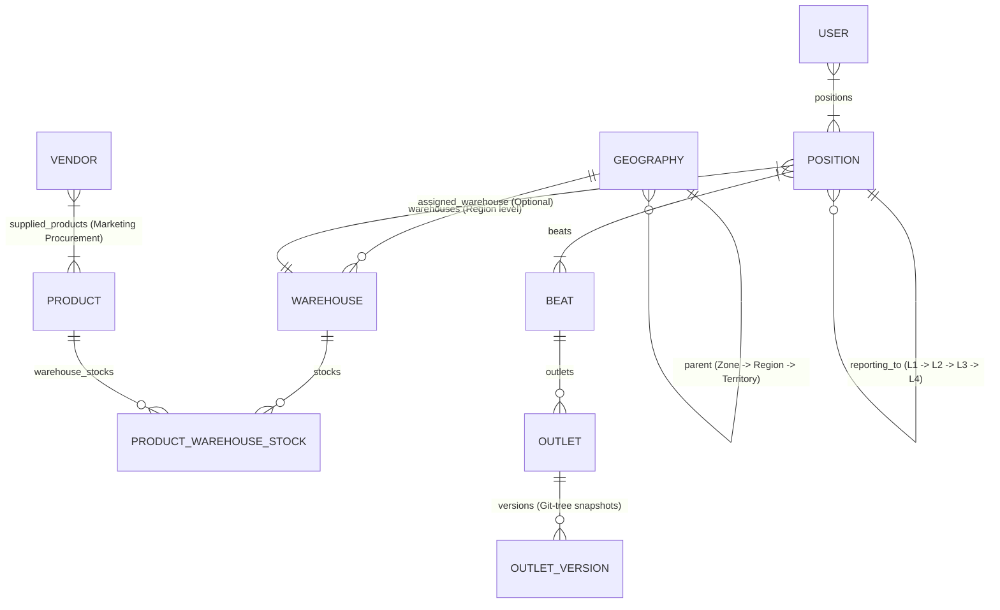

# Safar ERP — Sales & Distribution System Guide

## Overview
Safar ERP is a comprehensive FMCG Sales & Distribution Management System built with **FastAPI**, **SQLAlchemy**, **Jinja2 Templates**, and **MySQL (MAMP)**.

The system orchestrates:
- **Admin Onboarding & Dual-Bucket S3 Storage**: Onboarding handles Administrator account password setup and optional database backup restoration. S3 Object Storage is configured in **Admin Dashboard → System Settings → S3 Storage**, supporting two separate buckets: **Permanent Files - Bucket** (`s3_bucket_name`) for outlet photos, material requests, QC pictures, avatars, and **Parquet Daily Rolling Backups**, and **Temporary Files - Bucket** (`s3_files_bucket_name`) for database backups, PDF exports, & temporary reports.
- **Parquet Daily Rolling Backup Architecture**: Automated daily background job in `app/scheduler.py` (`01:00 AM IST`) and manual trigger in `/settings/backup`. Exports 12 operational/transactional tables (`orders`, `order_items`, `payments`, `payment_submissions`, `attendance`, `timesheets`, `expenses`, `material_requests`, `material_request_history_logs`, `vendor_quotations`, `work_orders`, `stock_movements`) up to the previous day into Snappy-compressed Apache Parquet format. Organizes objects in **Permanent Files - Bucket** under daily directory structure: `rolling_backups/parquet/YYYY-MM-DD/<table_name>.parquet`.
- **Server Startup & Entrypoint Migration Architecture**: Database migrations (`db_migrate.py`) run once in `entrypoint.sh` (PID 1) before Gunicorn forks workers — preventing multi-worker `ALTER TABLE` deadlocks. FastAPI `lifespan` only runs startup validation and scheduler init. Safe exception handling in `is_system_onboarded()` and `validate_s3_configuration()` for uninitialized databases.
- **Geography & Regional Warehouse Architecture**: Multi-tier hierarchy (`Zone` → `Region` → `Territory`) with region-level warehouse mapping and unified scoping (`get_user_allowed_geography_ids` & `get_user_allowed_warehouse_ids`).
- **Position Hierarchy**: 4-level organizational hierarchy (`L1` to `L4`) with automatic reporting parent warehouse inheritance resolution.
- **Beat & Outlet Management**: Beat territory selection scoped to L1 child territories under position/region hierarchy. Outlet scoping, non-admin approval workflows (`outlet_edit_approval`), Admin direct edit `OutletVersion` snapshots, version history, and Git-tree style version reverts.
- **Product & Inventory System**: PTR (Price to Retailer) pricing, multi-warehouse stock allocation scoped to user warehouses, zero-stock deactivation guardrails, and Stock Audit Log filter bar.
- **Vendor Operations**: Vendor supply management strictly scoped to assigned Region and child Territories.
- **Channel Partners**: Multi-channel distribution without CSV export clutter.
- **Action Center**: Centralized **Action Center** section housing **Approval Hub** (restricted to Position level > L2 & Geography scope >= Region or Admin with scoped pending counts), **Alerts & Notifications**, and **Auto-Flags** risk detection.
- **Analytics (Realtime & Scheduled)**: OOTB preset-filtered Realtime Analytics and Scheduled Analytics CSV report generator uploaded to S3/MinIO with expiring pre-signed URLs.
- **Sidebar Navigation Section Hierarchy**: Master Data menu scoping (hiding `Users & Reps` and `Positions` for Territory Managers) and Action Center section integration.
- **Leave Management & L1-L4 Approval Hierarchy**: Single-day leave application with Full Day / Half Day selection, stored in MySQL `leaves` table, with web management portal (`/leaves`) enforcing role & level approval rules (L1/L2 approved by L3/L4, L3 approved by L4 ONLY).

---

## 🏛️ System Architecture & Data Models

### Database Connection & Lifespan Validation
- **DB Engine**: MySQL (MAMP default on `127.0.0.1:8889`, database `safar_db`, user `root`, password `root`).
- **ORM Base**: SQLAlchemy 2.0.
- **Lifespan Startup Health Check**: `app/services/startup_validation.py` executes `validate_admin_and_s3_config()` inside FastAPI lifespan (`app/main.py`) on every server restart to verify an active Admin user exists and ping S3/MinIO storage.
- **S3 / MinIO Storage Adapter**: `app/adapters/s3_storage.py` manages image uploads (Outlets, Assets, Material Requests, Work Orders, Maintenance Logs), daily database backups, and pre-signed CSV report downloads.
- **Migration Script**: `PYTHONPATH=. ./venv/bin/python db_migrate.py`

### Key Models & Relationships



---

## 📍 1. Geography & Regional Warehouse Architecture

### Hierarchy Rules
1. **Zone**: Top-level geography node (`parent_id = None`).
2. **Region**: Mid-level node; **MUST** report to a `Zone`.
3. **Territory**: Field-level node; **MUST** report to a `Region`.

### Regional Warehouses & Unified Scoping Resolution
- Warehouses are assigned directly at the **Region** level (`Geography.level == GeoLevel.region`).
- **Bidirectional Model Relationship**: `Geography.warehouses` and `Warehouse.geography` maintain explicit bidirectional SQLAlchemy relationship `back_populates="geography"`, ensuring checkboxes in `/geography/{id}/edit` render DB selections accurately.
- **Unified Geography & Warehouse Scoping (`app/utils/geography_scope.py`)**:
  - `get_user_allowed_geography_ids(user, db)`: Resolves assigned Region + child Territories for Territory Managers based on `user.geography_id` or active `UserPosition` -> `Position.geography_id`. Admin receives `None` (unlimited scope).
  - `get_user_allowed_warehouse_ids(user, db)`: Resolves all warehouses attached to the user's allowed region geography IDs.

---

## 👔 2. Position Hierarchy & Warehouse Resolution

### Position Levels
- **L4**: Top-level executive management (`reporting_to_id = None`).
- **L3**: Regional management (reports to `L4`).
- **L2**: Area/Territory management (reports to `L3`).
- **L1**: Field sales representative / Beat execution level (reports to `L2`).

### Warehouse Resolution Algorithm (`resolve_warehouse`)
When an **Outlet** places an Order, Asset Request, or Material Request:
1. Identify the **L1 Position** linked to the Outlet's **Beat Route**.
2. Execute `position.resolve_warehouse()`:
   - Check if the **L1 Position** has a directly assigned active `warehouse_id`.
   - If not, traverse up the `reporting_to` hierarchy: **L2** → **L3** → **L4**.
   - Return the first active `Warehouse` found along the parent reporting chain.

---

## 📦 3. Product Catalog, Inventory Scoping & Audit Log Filters

### Category Scopes (`ProductCategory`)
- **Sales**: Core commercial FMCG products sold to retailers/outlets via Beats.
- **Marketing - Procurement**: Specialized promotional items supplied by external Vendors.
- **Marketing - Stock**: Promotional marketing items stored in warehouses.

### Inventory Scoping & Unmapped Warehouse Exclusion
- **Product List Scoping (`app/routers/inventory.py`)**: Products shown in the Stock Inventory page are strictly filtered to products that are attached to at least one active warehouse in the user's allowed warehouse scope (`get_user_allowed_warehouse_ids`). Products with no attached warehouses in the user's scope (e.g. `FRONTLIT-BOARD`) are completely excluded from view.
- **Attached Warehouse Badge Scoping (`app/templates/inventory/list.html`)**: Warehouse badges rendered under "Attached Warehouses" and stock totals are strictly filtered so that unauthorized warehouses (e.g. `TN COIMBATORE` for `kkalpanamuthu`) are hidden, and total units display only the stock balance within authorized warehouses.
- Product inventory breakdown modals (`/product/{id}/warehouse-details`), stock inwarding, and stock adjustments are strictly scoped to allowed user warehouses.

### Stock Audit Log Filters (`app/templates/inventory/movements.html`)
- Provides filter bar for searching stock movements by:
  - **Warehouse**
  - **Product**
  - **Movement Type** (`INWARD`, `OUTWARD`, `ADJUSTMENT`)
  - **Date From** & **Date To**

---

## 🏬 4. Vendors & Scope Control

- **Region Scope Field Refactoring**: Vendor list, creation, and edit routes (`app/routers/vendors.py`) enforce `Vendor.geography_id.in_(allowed_geo_ids)`.
- **Territory Manager Scope**: Territory Managers (e.g. `kkalpanamuthu10@gmail.com` with `North TN` scope) only see and manage vendors within their assigned Region and child Territories. Unauthorized regions (e.g. `Odisha`) are excluded.
- **Vendor Product Scope**: Restricted strictly to products with `category_type == ProductCategory.marketing_procurement`.

---

## 🏪 5. Outlets Scoping, Approval Mechanism & Git-Tree Version Reverts

- **Geography Scoping**: `app/routers/outlets.py` filters `Outlet.territory_id.in_(allowed_geo_ids)`.
- **Non-Admin Edit Approval Workflow**: When a Territory Manager or Field Rep submits an outlet edit, the outlet is NOT modified directly. An `AutoFlag` approval request (`entity_type="outlet_edit_approval"`) is created for Admin review.
- **Direct Admin Edit & Snapshotting**: Direct edits by Admin update the outlet after recording a pre-edit snapshot in `OutletVersion` (`app/models/outlet_version.py`).
- **Version History & Git-Tree Reverts**:
  - `/outlets/{id}/history` displays the version timeline (`app/templates/outlets/history.html`).
  - `/outlets/{id}/revert/{version_id}` allows Admins to revert the outlet to any prior state snapshot.

---

## 🛣️ 6. Beats & Routes Scoping

- **Territory Scoping**: Territory select control in Beat create/edit forms (`app/routers/beats.py`) only lists L1 child territories under the user's assigned position/region hierarchy (e.g. `Chennai TN` for `TN CHENNAI RSM`, hiding `Bhubaneswar Odisha`).
- **Channel Partner Scoping**: Channel Partners select list inside Beat forms is scoped to `get_user_allowed_geography_ids`.

---

## 🔔 7. Action Center (Approval Hub, Alerts, Auto-Flags)

The **Action Center** section in sidebar navigation (`app/templates/shared/sidebar.html`) aggregates operational workflows:

### A. Approval Hub (`/approvals`)
- **Access Rule**: Restricted to Admin and users with Position level > L2 (L3, L4, L5) and Geography scope >= Region (Region, Zone).
- **Geography-Scoped Pending Counts**: Calculates pending counts across Attendance, Timesheets, Payment Submissions, Expenses, Material Requests, and Outlet Edits filtered by user allowed geography IDs.

### B. Alerts & Notifications (`/analytics/alerts`)
- Operational alerts for unread counts, low stock warnings, and alert dismiss actions.

### C. Auto-Flags (`/flags`)
- Automated risk & anomaly detection flags:
  - `gps_out_of_range`: Location > 100m from outlet coordinates.
  - `short_visit`: Store visit < 2 minutes.
  - `gps_spoofing`: Mock location detection.
  - `payment_mismatch`: Denomination total mismatch against payment amount.
  - `outlet_edit_approval`: Master data outlet modification requests.

---

## 📊 8. Realtime & Scheduled Analytics

- **Realtime Analytics**: Preset chart-centric views for Sales Analytics (`/analytics/sales`), Rep Performance (`/analytics/reps`), and Marketing (`/analytics/marketing`).
- **Scheduled Analytics (`/analytics/scheduled`)**: Asynchronous CSV report generator (Sales Summary, Rep Performance, Inventory Audit, Master Outlets Register) uploaded to S3/MinIO with time-bound expiring download links.

---

## 👥 9. User Roles, Scope Matrix & Menu Restrictions

### Permissions & Menu Visibility
| Role (`UserRole`) | Scope & Navigation Visibility |
| :--- | :--- |
| **`admin`** | **Full Access**: All sections, Master Data (`Users & Reps`, `Positions`, `Geography`, `Beats`, `Outlets`, `Channel Partners`, `Vendors`), Configuration, Action Center. |
| **`territory_manager`** | **Regional Management Scope**: Assigned to Region (`Geography`). <br>• **Products Catalogue Restricted**: `/products` page, creation, and edits are strictly restricted to Admins. Hidden under Catalogue in sidebar navigation and inventory header. <br>• **Master Data Menu Scoping**: `Users & Reps` and `Positions` are hidden under Master Data in sidebar. Retains `Geography`, `Beats & Routes`, `Outlets` (approval-based edit), `Channel Partners` (CSV button removed), and `Vendors`. <br>• **Action Center Scope**: Access to Approval Hub (if Position > L2 & Geo >= Region), Alerts, Auto-Flags. |
| **`field_rep`** | **Field Mobile Execution**: Route visits, order taking, outlet edits (creates approval request), attendance, expenses. |

---

## 🧭 10. Sidebar Navigation Section Hierarchy

Standardized sidebar layout (`app/templates/shared/sidebar.html`):
1. **Dashboard**
2. **Field Tracking** *(Attendance, Visit Records, GPS Map View)*
3. **Operations** *(Orders, Expenses, Timesheets, Material Requests, Marketing Assets, Leave Management)*
4. **Action Center** *(Approval Hub, Alerts & Notifications, Auto-Flags)*
5. **Analytics** *(Sales Analytics, Rep Performance, Marketing, Scheduled Reports S3)*
6. **Catalogue** *(Products, Inventory, Warehouses)*
7. **Master Data** *(Geography, Users & Reps [Admin Only], Positions [Admin Only], Beats & Routes, Outlets, Channel Partners, Vendors)*
8. **Configuration** *(Sales Channels, SMTP Settings, Webhooks, WhatsApp API, Data Backup)*
9. **Developer** *(Mobile API Docs)*

---

## 🏖️ 16. Leave Management & L1-L4 Approval Hierarchy Architecture

### A. Mobile Application Single-Day & Full/Half Day Picker
- **Single Day Date Picker**: Single date selection for leave application in `mobile/lib/screens/leave/leave_apply_screen.dart`.
- **Duration Options**: Toggle card cards for **Full Day** vs **Half Day**, with half-day session dropdown (**First Half - Morning** / **Second Half - Afternoon**).

### B. Role & Level Leave Approval Hierarchy Rules (`app/models/user.py`)
- **Level Resolution (`user.level`)**: Evaluates highest position level (`L4`, `L3`, `L2`, `L1`). Admin defaults to `L4`.
- **Approval Permission Matrix (`user.can_approve_leave_for(applicant)`)**:
  - **L1 & L2 Applicants**: Can be approved/rejected by **L3** or **L4** users (and System Admin).
  - **L3 Applicants**: Can **ONLY** be approved/rejected by **L4** users (and System Admin).
  - **L1 & L2 Users**: Cannot approve any leave requests.
  - **L3 Users**: Cannot approve `L3` or `L4` leave requests.

### C. Web Admin Portal Integration (`/leaves`)
- **Admin Router (`app/routers/admin_leaves.py`)**: Lists leave applications (`GET /leaves`), enforces `can_approve_leave_for` checks, and processes approval (`POST /leaves/{id}/approve`) and rejection (`POST /leaves/{id}/reject`).
- **HTML Template (`app/templates/leaves/index.html`)**: Displays applicant level badges (`L1`, `L2`, `L3`, `L4`) and conditionally renders **Approve** / **Reject** buttons only if authorized. Displays `🔒 Requires L4 Approval Only` badge when an L3 leave is viewed by an unauthorized manager.

---

## 🛑 17. Back-Button Session Anti-Cache Protection

- **Web Anti-Cache Middleware (`app/main.py`)**: Appends anti-caching HTTP response headers (`Cache-Control: no-cache, no-store, must-revalidate, max-age=0, private`, `Pragma: no-cache`, `Expires: 0`) to all non-static web requests. Forces browsers to invalidate `bfcache` (Back-Forward cache), preventing logged-out session viewing when clicking the browser Back button.
- **Mobile Back Button Guard (`mobile/lib/screens/auth/login_screen.dart`)**: Wraps `LoginScreen` in `PopScope(canPop: false)`. Pressing the device back button on the Login screen exits the app (`SystemNavigator.pop()`) instead of popping into previously loaded session screens.

---

## 🧹 18. Demo Data Removal & Reset Utility

- **Disabled Auto-Seeding**: Commented out demo product seeding (`seed_products()`) in [`exclude_from_deployment/create_db.py`](file:///Users/johnwesleygovada/Desktop/Sastrybalm/exclude_from_deployment/create_db.py).
- **Data Truncation Utility**: [`clear_demo_data.py`](file:///Users/johnwesleygovada/Desktop/Sastrybalm/clear_demo_data.py) script truncates transactional tables (`orders`, `order_items`, `payments`, `expenses`, `leaves`, `material_requests`, `timesheets`, `asset_capitalizations`, `alerts`, `stock_movements`, `vendor_quotations`, `work_orders`).

---

## 🛍️ 19. Order Architecture, Party Refactoring & Embedded Payment Collection

### A. Polymorphic Party Refactoring (`orders` Table & UI)
- **Database & Model Refactoring**: Order target is generalized from `outlet_id` to `party_id` with `party_type` enum (`Outlet`, `Channel Partner`).
  - **`party_type = 'Outlet'`**: Secondary Orders created during store visits. Requires mandatory `visit_id` (Visit Record).
  - **`party_type = 'Channel Partner'`**: Primary Orders raised directly against distributors/channel partners without GPS/Geo tracking or visit records, capturing partner address details.
- **Backend & Web UI Labels**: All Order forms, filters, data tables, and REST endpoints present the unified **Party** concept with type badges (`Outlet` / `Channel Partner`).

### B. Warehouse Capture & L3 Position Resolution
- **Explicit Warehouse Storage**: `warehouse_id` is stored on every `Order` record to track inventory source and fulfillment node.
- **L3 Warehouse Resolution Algorithm**:
  1. Identify the **Outlet** → **Beat** → **L1 Position**.
  2. Traverse reporting hierarchy from L1 → L2 → **L3 Position**.
  3. Resolve the L3 Position's mapped user/geography and return the associated **Warehouse**.
  4. Map this warehouse to the Order's `warehouse_id`.

### C. Embedded Payment Collection Fields & Validation Logic
- **Order Model Payment Fields**:
  - `is_company_order` (Boolean: `1` for Company Order, `0` for Channel Partner/Standard).
  - `is_paid` (Boolean: `1` for Paid Order, `0` for Credit Order).
  - `payment_type` (`Full`, `Partial`, `Credit`, or `None`).
  - `payment_mode` (`Cash`, `UPI`, `NEFT/RTGS`, `Others`, or `None`).
  - `payment_reference` (String, reference / transaction ID).
- **Business Rules**:
  - **`is_company_order = 1`**: UI prompts user to choose **Credit Order** or **Paid Order**.
    - If **Credit Order**: sets `is_paid = 0`, `payment_type = 'Credit'`.
    - If **Paid Order**: sets `is_paid = 1`, requiring selection of `payment_type` (`Full`, `Partial`), `payment_mode` (`Cash`, `UPI`, `NEFT/RTGS`, `Others`), and `payment_reference`.

### D. Triple-Scoped Today's Order Fetching (`GET /api/v1/orders/outlet-today-l1-orders`)
- **Strict Scoping Enforcement**:
  1. **Outlet Scope (`outlet_id`)**: Restricts query to orders punched for the target outlet today.
  2. **Beat Scope (`beat_id`)**: Filters orders associated with the active beat route.
  3. **Position & Hierarchy Scope (`subordinate_user_id` / Manager Hierarchy)**: Enforces that `Order.user_id` matches the selected subordinate L1 rep or users within the manager's active position reporting hierarchy.

---

## 🛠️ Common Operations & Developer Commands

### Run Development Server
```bash
PYTHONPATH=. ./venv/bin/python run.py
```

### Apply Database Migrations
```bash
PYTHONPATH=. ./venv/bin/python db_migrate.py
```

### Clear All Demo Transactional Data
```bash
docker exec -i safar-app python - < clear_demo_data.py
```

### Verify Python Syntax
```bash
python3 -m py_compile app/main.py app/models/user.py app/routers/admin_leaves.py app/utils/geography_scope.py app/routers/vendors.py app/routers/outlets.py
```

---

## ✅ 20. Verified Workflow Completion (2026-07-28)

### Orders and Warehouse
- Orders persist unified Party, warehouse, delivery address, Company/Paid flags, payment type/mode/reference, and mandatory Visit linkage for Secondary Orders.
- Primary Orders require a Channel Partner Party and no Visit/GPS. Secondary Orders require an Outlet Party and the submitting user's current-day Visit.
- Company Orders reject invalid payment states, non-Sales/non-stockable products, and quantities exceeding resolved warehouse stock.
- L3 warehouse resolution follows Beat L1 → L2 → L3 → assigned L3 user → Geography → active Warehouse, with position inheritance fallback; creation fails if none resolves.
- Web/API presentation uses Party name/type and exposes warehouse and embedded payment details.

### Joint Working
- Only L2/L3/L4 managers can operate Joint Working.
- Assigned L1 users come only from active descendant L1 Positions in the manager's reporting tree; vacant positions are excluded.
- Subordinate Beat and same-day Order lookups repeat hierarchy authorization server-side.
- Joint visits persist selected L1 user, Outlet, notes, no-order reason, linked current-day L1 Order, device GPS, and validated JPG/PNG/WEBP photo evidence.

### Leaves
- Single-day leave persists `duration` and `half_day_session`.
- L3 approves descendant L1/L2 only; L4 approves its reporting subtree including L3; System Admin is global.
- The web list includes only applications the current approver may act on.

### Verification
- Python compile, Docker health/migrations, MySQL schema inspection, and live OpenAPI assertions: PASS.
- Flutter analyzer: no compilation errors; unrelated existing lint/deprecation warnings remain.

---

## ✅ 21. Outlet Material Requests & Marketing Stock Assets (2026-07-28)

### Outlet-scoped mobile actions
- Outlet Detail exposes **New MR** and **Assets**. Assets opens a bottom action sheet with **Asset List** and **New Asset**.
- Routes carry `outletId` explicitly: `/outlet/:id/material-requests/new`, `/outlet/:id/assets`, and `/outlet/:id/assets/new`.

### Material Request rules
- Each newly submitted MR links exactly one active Product with `category_type = "Marketing - Procurement"`.
- The API accepts multipart form data with a required description and three required JPG/PNG/WEBP images (maximum 5 MB each): Present Outlet, Installation Place, and Customer Approval Letter.
- Optional Length, Width, Height, and Depth are persisted independently with a unit. Supplied values must be positive.
- Outlet name, address, contact, GPS, and the three image URLs are snapshotted on the MR for historical auditability.
- Legacy `category`, `approx_dimensions`, and `image_url` fields remain populated/compatible for existing web and procurement flows.

### Marketing Stock asset rules
- Eligible assets are active `Marketing - Stock` Products with active, positive `ProductWarehouseStock` in the warehouse resolved through the Outlet Beat and L3 hierarchy.
- Mobile clients cannot choose or type a warehouse, item name, or item code. The backend derives them from the resolved warehouse and selected Product.
- Deployment locks the warehouse stock row, rejects insufficient stock with HTTP 409, creates the Asset Capitalization, deducts stock, and writes an `OUTWARD` Stock Movement in one transaction.
- Asset records retain linked `product_id`/`warehouse_id` plus name/code/warehouse snapshots for historical display.

### API contracts
- `GET /api/v1/outlets/{outlet_id}/material-request-context`
- `POST /api/v1/material-requests`
- `GET /api/v1/outlets/{outlet_id}/asset-products`
- `GET /api/v1/outlets/{outlet_id}/assets`
- `POST /api/v1/asset-capitalizations`

### Runtime verification
- Database migrations add the MR product, dimension, snapshot, and image columns plus Asset product/warehouse links without invalidating legacy rows.
- Docker App and MySQL services are healthy; migrations and Gunicorn multi-worker startup pass; API docs return HTTP 200 through Nginx port `8080`.
- The configured S3 bucket currently returns `HeadBucket 403 Forbidden`; `upload_image_file` therefore uses its existing local static-storage fallback until bucket credentials/policy are corrected.

---

## ✅ 22. Role-Based Procurement Lifecycle (2026-07-28)

### Enforced lifecycle
- L1 creates one-Product Marketing Procurement MR → L3/L4 assigns Vendor → Vendor Technician submits two-image Recce → L3/L4 approves/rejects Recce → Vendor Admin submits server-calculated GST Quotation → L3/L4 approves Quotation and creates exactly one Work Order.
- Vendor Admin acknowledges Assigned Work Orders and reports monotonic progress. `100%` transitions automatically to `QC Pending`.
- QC Manager submits a two-image QC Report, remark, and maintenance schedule. Completion locks the Vendor sequence, creates a unique Vendor Batch ID, creates one Ready Procurement Item in the resolved L3 warehouse, and records an inward Stock Movement.
- Vendor Technician deploys a Ready Item exactly once. Deployment creates the linked Asset, changes Item status to `Asset Capitalised`, and creates an outward Stock Movement.
- Maintenance supports `In Progress → Completed → Validated`, immutable progress logs, image evidence, and QC-only validation.

### Integrity and security
- Removed fallback Vendor/Outlet ID `1` behavior from the lifecycle.
- Vendor Admin/Technician queries and mutations are restricted to `current_user.vendor_id`; QC queries honor assigned `qc_vendors`.
- L3/L4-only guards protect Vendor assignment and Recce/Quotation review.
- Unique/transactional guards prevent duplicate Work Orders per Quotation, Items per completed QC, and Assets per Procurement Item.
- QC recall invalidates (never deletes) an uninstalled Item and records an outward reversal. Installed Items block direct recall.
- Field Rep Approvals Hub is a self-submission/status hub and exposes only high-level procurement entities; confidential Recce, Quotation, QC, and Item payloads remain role-scoped.

### New persistence
- `work_order_progress_logs`, `qc_reports`, `procurement_attachments`, and `maintenance_progress_logs`.
- Structured Recce dimensions, approval/rejection metadata and versions.
- Quotation base/GST/total snapshots and approval metadata.
- Work Order acknowledgement/progress fields.
- Procurement Item Product/Warehouse/QC Report links and invalidation metadata.
- Vendor locked batch prefix/sequence.
- Asset state plus Maintenance status/progress/completion/validation metadata.

### Performance
- Composite indexes cover MR Vendor/status, WO Vendor/status, Item Vendor/status/warehouse, and Maintenance status/date.
- Backend procurement lists use joined/select-in eager loading to avoid summary-card N+1 queries.
- Mobile list endpoints return bounded role-scoped summaries; map views use coordinate-only records and OpenStreetMap.

### Verification
- Python compile: PASS.
- Flutter analyzer: no compilation errors; existing lint/deprecation diagnostics remain.
- MySQL migrations are repeatable and repaired legacy missing `work_orders.outlet_id`, `manufactured_photo_url`, and Quotation Recce fields.
- ORM parity queries for every new model: PASS.
- Docker App/MySQL healthy; live OpenAPI exposes all role lifecycle endpoints through Nginx port `8080`.

---

## ✅ 23. Production Security Gate 1 (2026-07-29)

### Authentication
- Newly issued login OTPs are stored only as bcrypt hashes and are never returned by the API, written to Alerts, or logged.
- OTP requests use a generic non-enumerating response, are limited to three per user per 15 minutes, expire after 10 minutes, and lock after five failed verification attempts.
- The duplicate debug `/api/auth/login` route and token-bearing response logging were removed.

### Runtime hardening
- Production startup rejects default/short secrets, missing CMMS webhook keys, insecure cookies, and wildcard CORS configuration.
- CMMS webhooks fail closed when their secret is absent.
- CORS uses an explicit environment allowlist; browser responses include anti-sniffing, frame, referrer, and permissions headers, plus HSTS when secure cookies are enabled.
- MySQL, Adminer, the direct app port, and Nginx are bound to localhost in the development Compose stack; Adminer is version-pinned.

### Scheduler and migrations
- Gunicorn workers no longer start APScheduler.
- A dedicated `scheduler` Compose service owns all seven scheduled jobs exactly once.
- Migration failure now stops application startup instead of allowing a partially migrated service to report healthy.

### Verification
- Focused security regression tests: 4 passed.
- App and MySQL containers: healthy.
- Dedicated scheduler: running with seven registered jobs.
- Protected live API: HTTP 401 with security headers.
- S3 remains externally blocked by `HeadBucket 403` and is still a production release blocker.
