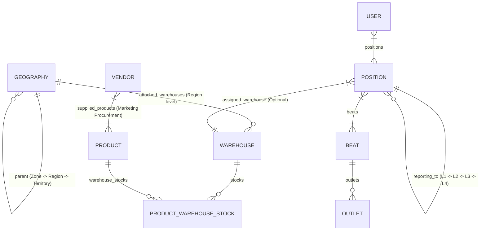

# Sastrybalm ERP — Sales & Distribution System Guide

## Overview
Sastrybalm ERP is a comprehensive FMCG Sales & Distribution Management System built with **FastAPI**, **SQLAlchemy**, **Jinja2 Templates**, and **MySQL (MAMP)**.

The system orchestrates:
- **Geography Management**: Multi-tier hierarchy (`Zone` → `Region` → `Territory`).
- **Warehouse Infrastructure**: Regional depots attached to Geographies, multi-warehouse product stock tracking, and stock movement auditing.
- **Position Hierarchy**: 4-level organizational hierarchy (`L1` to `L4`) with automatic reporting parent warehouse inheritance resolution.
- **Beat & Outlet Management**: Field routes (`GT` / `MT`) assigned to `L1 Positions` and mapped to `Outlets`.
- **Product & Inventory System**: Product cataloging with PTR (Price to Retailer) pricing, category scopes (`Sales`, `Marketing - Procurement`, `Marketing - Stock`), multi-warehouse stock allocation, and zero-stock deactivation guardrails.
- **Vendor Operations**: Specialized vendor supply management scoped to `Marketing - Procurement` products.
- **User Roles & Scope Matrix**: Granular permissions matrix for Admin, Territory Manager, Field Rep, QC Manager, Vendor Admin, and Vendor Technician.

---

## 🏛️ System Architecture & Data Models

### Database Connection
- **DB Engine**: MySQL (MAMP default on `127.0.0.1:8889`, database `sastrybalm_db`, user `root`, password `root`).
- **ORM Base**: SQLAlchemy 2.0.
- **Migration Script**: `PYTHONPATH=. ./venv/bin/python db_migrate.py`

### Key Models & Relationships



---

## 📍 1. Geography & Regional Warehouse Architecture

### Hierarchy Rules
1. **Zone**: Top-level geography node (`parent_id = None`).
2. **Region**: Mid-level node; **MUST** report to a `Zone`.
3. **Territory**: Field-level node; **MUST** report to a `Region`.

### Regional Warehouses & Permission Resolution
- Warehouses are assigned directly at the **Region** level (`Geography.level == GeoLevel.region`).
- **Mandatory Region Warehouse Rule**: A Region **MUST** contain at least one attached Warehouse mandatorily during creation (`/geography/new`) and editing (`/geography/{id}/edit`). Saving a Region without selecting at least one warehouse is rejected with a validation error.
- **Territory Manager Warehouse Resolution**: Permission to access, inward, and adjust inventory for warehouses is resolved directly from the **Region** (`geography_id`) assigned to the Territory Manager. Any warehouse attached to that Region (`Warehouse.geography_id == User.geography_id`) is automatically accessible by that Territory Manager, eliminating the need for direct per-user warehouse assignments.

---

## 👔 2. Position Hierarchy & Warehouse Resolution

### Position Levels
- **L4**: Top-level executive management (`reporting_to_id = None`).
- **L3**: Regional management (reports to `L4`).
- **L2**: Area/Territory management (reports to `L3`).
- **L1**: Field sales representative / Beat execution level (reports to `L2`).

### Warehouse Resolution Algorithm (`resolve_warehouse`)
When an **Outlet** places an Order, Asset Request, or Material Request:
1. Identify the **L1 Position** linked to the Outlet's **Beat Route**.
2. Execute `position.resolve_warehouse()`:
   - Check if the **L1 Position** has a directly assigned active `warehouse_id`.
   - If not, traverse up the `reporting_to` hierarchy: **L2** → **L3** → **L4**.
   - Return the first active `Warehouse` found along the parent reporting chain.
3. **L1 Position Save Validation**:
   - Saving an `L1 Position` requires that a valid warehouse can be resolved (either directly assigned or inherited from its reporting parent hierarchy L2/L3/L4). If no warehouse is resolved, saving is rejected with a validation error.

---

## 📦 3. Product Catalog & Inventory Rules

### Category Scopes (`ProductCategory`)
- **Sales**: Core commercial FMCG products sold to retailers/outlets via Beats.
- **Marketing - Procurement**: Specialized promotional items supplied by external Vendors.
- **Marketing - Stock**: Promotional marketing items stored in warehouses.

### Pricing & Terminology
- **MRP**: Maximum Retail Price.
- **PTR**: Price to Retailer (replaces Unit Cost across UI forms, inventory tables, and reports).

### Multi-Warehouse Stock Management
- Products can be attached to multiple warehouses via the dedicated **Attach Warehouses** dual pick-list interface (`/products/{product_id}/attach-warehouses`).
- Each warehouse maintains independent stock quantities (`ProductWarehouseStock`).
- **Stock Deactivation Guardrail**: A product cannot be deactivated if there is remaining stock present across any warehouse. Attempting to deactivate a stocked product triggers a dashboard-styled modal alert.

---

## 🏬 4. Vendors & Scope Control

- **Vendor Product Scope**: Restricted strictly to products with `category_type == ProductCategory.marketing_procurement`.
- **Vendor Geography Scope**: Vendor geography scope is strictly limited to **Regions** (`GeoLevel.region`). Forms and dropdowns filter available geographies exclusively to Region-level nodes.
- **Regional Scope Resolution**: Vendors managed by a **Territory Manager** are resolved and filtered directly by the `geography_id` (Region) field on the `Vendor` model (`Vendor.geography_id == User.geography_id`). Vendors created by a Territory Manager are automatically tagged with their assigned Region.
- **Vendor Users**: Mobile and web logins for `Vendor Admin` and `Vendor Technician` roles.

---

## 👥 5. User Roles & Permission Matrix

| Role (`UserRole`) | Scope & Administrative Controls |
| :--- | :--- |
| **`admin`** | **Full Administrative Access**: Authorized to create, edit, deactivate, or manage all Master Data (Geographies, Warehouses, Users, Products, Positions L1-L4, Beats, Vendors, Sales Channels, SMTP/System Settings). |
| **`territory_manager`** | **Regional Management Scope**: Assigned to a specific Region (`Geography`). <br>• **Warehouse Access Resolution**: User permission to access, inward, and adjust inventory for warehouses is resolved directly from their assigned **Region** (`User.geography_id`). Any warehouse attached to that Region (`Warehouse.geography_id == User.geography_id`) is automatically accessible by that Territory Manager. <br>• **Vendor Access Resolution**: Vendors managed by a Territory Manager are resolved and filtered directly by the `geography_id` (Region) field on the `Vendor` model (`Vendor.geography_id == User.geography_id`). <br>• **Allowed Actions**: Can create/edit **L1 Positions**, create/edit **Channel Partners**, create/edit **Field Rep Users**, create/edit **Beats & Routes**, attach beats to L1 positions, create/edit **Vendors** in their region, and perform **Inventory Inwarding & Stock Adjustments** for warehouses attached to their assigned region. <br>• **Restricted Actions**: Cannot create/edit/deactivate Geographies, Warehouses, Admin/TM Users, Products, or L2–L4 Positions. |
| **`field_rep`** | **Field Mobile Execution**: Beat route visits, order taking, outlet creation, attendance, and expense submissions. |
| **`qc_manager`** | **Quality Control**: Audit logs & quality inspections. *(Hides position hierarchy selector)* |
| **`vendor_admin`** | **Vendor Operations**: Material request processing & vendor employee management. *(Hides position hierarchy selector)* |
| **`vendor_technician`** | **Vendor Field Tech**: Installation & asset maintenance. *(Hides position hierarchy selector)* |

---

## 🤝 6. Channel Partners Rules & Mandates

- **Mandatory Geography Scope**: Every Channel Partner must be assigned to a Geography node scoped strictly to **Territory** (`GeoLevel.territory`) or **Region** (`GeoLevel.region`). Saving a Channel Partner without a valid Territory/Region geography scope is rejected.
- **Mandatory Multi-Select Sales Channels**: Every Channel Partner must have at least one **Sales Channel** selected from the available beat types (e.g. `GT`, `MT`). Selection is mandatory during creation and edits.

---

## 💾 7. Database Backup & Schema Mismatch Synchronization Strategy

- **Format & Retention**: System database backups are generated as executable `.sql` dump files containing `DROP TABLE IF EXISTS` statements, `SHOW CREATE TABLE` DDL structures, and column-explicit batch `INSERT INTO` statements. The system automatically retains only the 5 most recent backup files.
- **Handling Mismatches Between Backup Schema & Present Schema**:
  1. **Explicit Column Names (`INSERT INTO \`table\` (\`col1\`, \`col2\`)`)**: Prevents column count crashes. New columns in the active DB automatically default to their defined `DEFAULT` values (e.g. `is_active=1`, `created_at=NOW()`).
  2. **Automated Idempotent Post-Restore Migration (`db_migrate.py`)**: Immediately after importing/restoring a `.sql` backup, `db_migrate.py` must be executed to run `add_column_safely()`, adding any missing tables or columns required by the active application code.
  3. **Foreign Key Safety**: Backups wrap imports inside `SET FOREIGN_KEY_CHECKS=0;` and `SET FOREIGN_KEY_CHECKS=1;` to prevent foreign key constraint ordering deadlocks.
  4. **Header Version Verification**: `.sql` headers contain software version and timestamp metadata for schema version tracking.

---

## 🛠️ Common Operations & Developer Commands

### Run Development Server
```bash
PYTHONPATH=. ./venv/bin/python run.py
```

### Apply Database Migrations
```bash
PYTHONPATH=. ./venv/bin/python db_migrate.py
```

### Verify Application Health
```bash
curl -I http://127.0.0.1:8090/login
```

---

## ⚠️ Common Pitfalls & Checklist
1. **Never alter L1-L4 Position reporting rules**: L1 must report to L2, L2 to L3, L3 to L4.
2. **Always run `db_migrate.py` after model changes**: Custom schema migrations are handled safely via `add_column_safely()`.
3. **Use PTR label everywhere**: Ensure `PTR` is displayed instead of `Unit Cost` in product listing and stock reports.
4. **Enforce Glassmorphic Alerts**: JavaScript alerts must use the custom modal design system (`confirmSubmit` / custom modal alerts).
5. **Territory Manager Scope Rules**: Territory Managers can create/edit L1 Positions, create/edit Beats & Routes, create/edit Vendors, and perform inventory inwarding/adjustments for regional warehouses. They cannot create/edit Geographies, Warehouses, Users, Products, or L2-L4 Positions.
6. **Inventory Stock Deactivation Validation**: Deactivating any Product, Warehouse, or Region must validate that active inventory stock is 0. If inventory stock is present, deactivation is rejected with a clear validation error.
7. **No Hardcoded Test Warehouses**: Warehouses must never be hardcoded or auto-seeded in migration scripts (`db_migrate.py`) or setting routers. All warehouses must be explicitly configured via Admin controls.
8. **Channel Partner Mandatory Fields**: Channel Partners require mandatory selection of at least 1 Sales Channel (Multi-select) and a Geography Scope limited to Territory or Region.
9. **SQL Database Backups & 5-File Retention Policy**: System database backups are generated in standard executable `.sql` format. The system automatically retains only the 5 most recent backup files, purging older files upon new backup creation.
10. **Post-Restore Schema Synchronization**: Always run `db_migrate.py` after restoring any `.sql` backup to align the schema with the latest application models via `add_column_safely()`.
11. **First Bootup Onboarding & Encrypted Admin Password**: Admin credentials are no longer served from `.env`. On first bootup, the system presents an Onboarding Wizard (`/onboarding`) to configure Admin credentials (saved as bcrypt hash in `users` table) and optionally restore data from a `.sql` backup.
