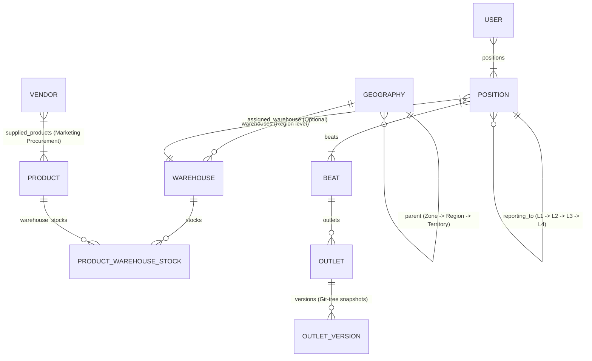

# Sastrybalm ERP — Sales & Distribution System Guide

## Overview
Sastrybalm ERP is a comprehensive FMCG Sales & Distribution Management System built with **FastAPI**, **SQLAlchemy**, **Jinja2 Templates**, and **MySQL (MAMP)**.

The system orchestrates:
- **Mandatory S3 Storage & Onboarding Trigger**: If S3/MinIO bucket storage is not configured or fails connectivity checks, `is_system_onboarded(db)` returns `False`, forcing redirection to `/onboarding`. Features an interactive **"⚡ Test S3 / MinIO Connection"** AJAX action button (`POST /onboarding/test-s3`) to verify bucket credentials and endpoint reachability with live feedback banners before completing setup.
- **Server Startup Validation & S3/MinIO Storage**: Server restart (`lifespan`) validation of active Admin account and S3 bucket connection, asset storage, daily backups, and time-bound pre-signed URLs.
- **Geography & Regional Warehouse Architecture**: Multi-tier hierarchy (`Zone` → `Region` → `Territory`) with region-level warehouse mapping and unified scoping (`get_user_allowed_geography_ids` & `get_user_allowed_warehouse_ids`).
- **Position Hierarchy**: 4-level organizational hierarchy (`L1` to `L4`) with automatic reporting parent warehouse inheritance resolution.
- **Beat & Outlet Management**: Beat territory selection scoped to L1 child territories under position/region hierarchy. Outlet scoping, non-admin approval workflows (`outlet_edit_approval`), Admin direct edit `OutletVersion` snapshots, version history, and Git-tree style version reverts.
- **Product & Inventory System**: PTR (Price to Retailer) pricing, multi-warehouse stock allocation scoped to user warehouses, zero-stock deactivation guardrails, and Stock Audit Log filter bar.
- **Vendor Operations**: Vendor supply management strictly scoped to assigned Region and child Territories.
- **Channel Partners**: Multi-channel distribution without CSV export clutter.
- **Action Center**: Centralized **Action Center** section housing **Approval Hub** (restricted to Position level > L2 & Geography scope >= Region or Admin with scoped pending counts), **Alerts & Notifications**, and **Auto-Flags** risk detection.
- **Analytics (Realtime & Scheduled)**: OOTB preset-filtered Realtime Analytics and Scheduled Analytics CSV report generator uploaded to S3/MinIO with expiring pre-signed URLs.
- **Sidebar Navigation Section Hierarchy**: Master Data menu scoping (hiding `Users & Reps` and `Positions` for Territory Managers) and Action Center section integration.

---

## 🏛️ System Architecture & Data Models

### Database Connection & Lifespan Validation
- **DB Engine**: MySQL (MAMP default on `127.0.0.1:8889`, database `sastrybalm_db`, user `root`, password `root`).
- **ORM Base**: SQLAlchemy 2.0.
- **Lifespan Startup Health Check**: `app/services/startup_validation.py` executes `validate_admin_and_s3_config()` inside FastAPI lifespan (`app/main.py`) on every server restart to verify an active Admin user exists and ping S3/MinIO storage.
- **S3 / MinIO Storage Adapter**: `app/adapters/s3_storage.py` manages image uploads (Outlets, Assets, Material Requests, Work Orders, Maintenance Logs), daily database backups, and pre-signed CSV report downloads.
- **Migration Script**: `PYTHONPATH=. ./venv/bin/python db_migrate.py`

### Key Models & Relationships



---

## 📍 1. Geography & Regional Warehouse Architecture

### Hierarchy Rules
1. **Zone**: Top-level geography node (`parent_id = None`).
2. **Region**: Mid-level node; **MUST** report to a `Zone`.
3. **Territory**: Field-level node; **MUST** report to a `Region`.

### Regional Warehouses & Unified Scoping Resolution
- Warehouses are assigned directly at the **Region** level (`Geography.level == GeoLevel.region`).
- **Bidirectional Model Relationship**: `Geography.warehouses` and `Warehouse.geography` maintain explicit bidirectional SQLAlchemy relationship `back_populates="geography"`, ensuring checkboxes in `/geography/{id}/edit` render DB selections accurately.
- **Unified Geography & Warehouse Scoping (`app/utils/geography_scope.py`)**:
  - `get_user_allowed_geography_ids(user, db)`: Resolves assigned Region + child Territories for Territory Managers based on `user.geography_id` or active `UserPosition` -> `Position.geography_id`. Admin receives `None` (unlimited scope).
  - `get_user_allowed_warehouse_ids(user, db)`: Resolves all warehouses attached to the user's allowed region geography IDs.

---

## 👔 2. Position Hierarchy & Warehouse Resolution

### Position Levels
- **L4**: Top-level executive management (`reporting_to_id = None`).
- **L3**: Regional management (reports to `L4`).
- **L2**: Area/Territory management (reports to `L3`).
- **L1**: Field sales representative / Beat execution level (reports to `L2`).

### Warehouse Resolution Algorithm (`resolve_warehouse`)
When an **Outlet** places an Order, Asset Request, or Material Request:
1. Identify the **L1 Position** linked to the Outlet's **Beat Route**.
2. Execute `position.resolve_warehouse()`:
   - Check if the **L1 Position** has a directly assigned active `warehouse_id`.
   - If not, traverse up the `reporting_to` hierarchy: **L2** → **L3** → **L4**.
   - Return the first active `Warehouse` found along the parent reporting chain.

---

## 📦 3. Product Catalog, Inventory Scoping & Audit Log Filters

### Category Scopes (`ProductCategory`)
- **Sales**: Core commercial FMCG products sold to retailers/outlets via Beats.
- **Marketing - Procurement**: Specialized promotional items supplied by external Vendors.
- **Marketing - Stock**: Promotional marketing items stored in warehouses.

### Inventory Scoping & Unmapped Warehouse Exclusion
- **Product List Scoping (`app/routers/inventory.py`)**: Products shown in the Stock Inventory page are strictly filtered to products that are attached to at least one active warehouse in the user's allowed warehouse scope (`get_user_allowed_warehouse_ids`). Products with no attached warehouses in the user's scope (e.g. `FRONTLIT-BOARD`) are completely excluded from view.
- **Attached Warehouse Badge Scoping (`app/templates/inventory/list.html`)**: Warehouse badges rendered under "Attached Warehouses" and stock totals are strictly filtered so that unauthorized warehouses (e.g. `TN COIMBATORE` for `kkalpanamuthu`) are hidden, and total units display only the stock balance within authorized warehouses.
- Product inventory breakdown modals (`/product/{id}/warehouse-details`), stock inwarding, and stock adjustments are strictly scoped to allowed user warehouses.

### Stock Audit Log Filters (`app/templates/inventory/movements.html`)
- Provides filter bar for searching stock movements by:
  - **Warehouse**
  - **Product**
  - **Movement Type** (`INWARD`, `OUTWARD`, `ADJUSTMENT`)
  - **Date From** & **Date To**

---

## 🏬 4. Vendors & Scope Control

- **Region Scope Field Refactoring**: Vendor list, creation, and edit routes (`app/routers/vendors.py`) enforce `Vendor.geography_id.in_(allowed_geo_ids)`.
- **Territory Manager Scope**: Territory Managers (e.g. `kkalpanamuthu10@gmail.com` with `North TN` scope) only see and manage vendors within their assigned Region and child Territories. Unauthorized regions (e.g. `Odisha`) are excluded.
- **Vendor Product Scope**: Restricted strictly to products with `category_type == ProductCategory.marketing_procurement`.

---

## 🏪 5. Outlets Scoping, Approval Mechanism & Git-Tree Version Reverts

- **Geography Scoping**: `app/routers/outlets.py` filters `Outlet.territory_id.in_(allowed_geo_ids)`.
- **Non-Admin Edit Approval Workflow**: When a Territory Manager or Field Rep submits an outlet edit, the outlet is NOT modified directly. An `AutoFlag` approval request (`entity_type="outlet_edit_approval"`) is created for Admin review.
- **Direct Admin Edit & Snapshotting**: Direct edits by Admin update the outlet after recording a pre-edit snapshot in `OutletVersion` (`app/models/outlet_version.py`).
- **Version History & Git-Tree Reverts**:
  - `/outlets/{id}/history` displays the version timeline (`app/templates/outlets/history.html`).
  - `/outlets/{id}/revert/{version_id}` allows Admins to revert the outlet to any prior state snapshot.

---

## 🛣️ 6. Beats & Routes Scoping

- **Territory Scoping**: Territory select control in Beat create/edit forms (`app/routers/beats.py`) only lists L1 child territories under the user's assigned position/region hierarchy (e.g. `Chennai TN` for `TN CHENNAI RSM`, hiding `Bhubaneswar Odisha`).
- **Channel Partner Scoping**: Channel Partners select list inside Beat forms is scoped to `get_user_allowed_geography_ids`.

---

## 🔔 7. Action Center (Approval Hub, Alerts, Auto-Flags)

The **Action Center** section in sidebar navigation (`app/templates/shared/sidebar.html`) aggregates operational workflows:

### A. Approval Hub (`/approvals`)
- **Access Rule**: Restricted to Admin and users with Position level > L2 (L3, L4, L5) and Geography scope >= Region (Region, Zone).
- **Geography-Scoped Pending Counts**: Calculates pending counts across Attendance, Timesheets, Payment Submissions, Expenses, Material Requests, and Outlet Edits filtered by user allowed geography IDs.

### B. Alerts & Notifications (`/analytics/alerts`)
- Operational alerts for unread counts, low stock warnings, and alert dismiss actions.

### C. Auto-Flags (`/flags`)
- Automated risk & anomaly detection flags:
  - `gps_out_of_range`: Location > 100m from outlet coordinates.
  - `short_visit`: Store visit < 2 minutes.
  - `gps_spoofing`: Mock location detection.
  - `payment_mismatch`: Denomination total mismatch against payment amount.
  - `outlet_edit_approval`: Master data outlet modification requests.

---

## 📊 8. Realtime & Scheduled Analytics

- **Realtime Analytics**: Preset chart-centric views for Sales Analytics (`/analytics/sales`), Rep Performance (`/analytics/reps`), and Marketing (`/analytics/marketing`).
- **Scheduled Analytics (`/analytics/scheduled`)**: Asynchronous CSV report generator (Sales Summary, Rep Performance, Inventory Audit, Master Outlets Register) uploaded to S3/MinIO with time-bound expiring download links.

---

## 👥 9. User Roles, Scope Matrix & Menu Restrictions

### Permissions & Menu Visibility
| Role (`UserRole`) | Scope & Navigation Visibility |
| :--- | :--- |
| **`admin`** | **Full Access**: All sections, Master Data (`Users & Reps`, `Positions`, `Geography`, `Beats`, `Outlets`, `Channel Partners`, `Vendors`), Configuration, Action Center. |
| **`territory_manager`** | **Regional Management Scope**: Assigned to Region (`Geography`). <br>• **Products Catalogue Restricted**: `/products` page, creation, and edits are strictly restricted to Admins. Hidden under Catalogue in sidebar navigation and inventory header. <br>• **Master Data Menu Scoping**: `Users & Reps` and `Positions` are hidden under Master Data in sidebar. Retains `Geography`, `Beats & Routes`, `Outlets` (approval-based edit), `Channel Partners` (CSV button removed), and `Vendors`. <br>• **Action Center Scope**: Access to Approval Hub (if Position > L2 & Geo >= Region), Alerts, Auto-Flags. |
| **`field_rep`** | **Field Mobile Execution**: Route visits, order taking, outlet edits (creates approval request), attendance, expenses. |

---

## 🧭 10. Sidebar Navigation Section Hierarchy

Standardized sidebar layout (`app/templates/shared/sidebar.html`):
1. **Dashboard**
2. **Field Tracking** *(Attendance, Visit Records, GPS Map View)*
3. **Operations** *(Orders, Expenses, Timesheets, Material Requests, Marketing Assets)*
4. **Action Center** *(Approval Hub, Alerts & Notifications, Auto-Flags)*
5. **Analytics** *(Sales Analytics, Rep Performance, Marketing, Scheduled Reports S3)*
6. **Catalogue** *(Products, Inventory, Warehouses)*
7. **Master Data** *(Geography, Users & Reps [Admin Only], Positions [Admin Only], Beats & Routes, Outlets, Channel Partners, Vendors)*
8. **Configuration** *(Sales Channels, SMTP Settings, Webhooks, WhatsApp API, Data Backup)*
9. **Developer** *(Mobile API Docs)*

---

## 🛠️ Common Operations & Developer Commands

### Run Development Server
```bash
PYTHONPATH=. ./venv/bin/python run.py
```

### Apply Database Migrations
```bash
PYTHONPATH=. ./venv/bin/python db_migrate.py
```

### Verify Python Syntax
```bash
python3 -m py_compile app/main.py app/services/startup_validation.py app/adapters/s3_storage.py app/utils/geography_scope.py app/routers/vendors.py app/routers/outlets.py app/routers/inventory.py app/routers/warehouses.py app/routers/beats.py app/routers/approvals.py app/routers/analytics.py
```
